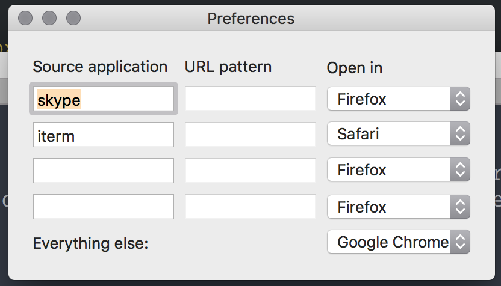

# prowser

Prowser is a small utility for MacOS which makes sure you open links in the browser of your choice.
For example: Open all links clicked in Slack in Firefox, but all links from Skype in Chrome.

Set it to your default brower to use it (you will be prompted to do that on startup if prowser).
And then hit up the Preferences to configure it.

## Preferences overview

These rules will be evaluated one at a time, the first one matching will decide the target application to use.
So in this particular example any linked clicked in skype will be opened in Firefox. Any link clicked in iterm (or iterm2),
will be opened in Safari. Everything else will be opened in chrome.

## Limitations

- No support for the URL pattern matching yet. The idea is to allow some simple patterns here that must also match to trigger
the target application. For example `*imgur*` would match all imgur links.
- Only tested on my macOS Sierra laptop.

## Build and run

I have yet to publish this to the App store (or anywhere else really) - so you need to build this yourself. Here's how:

1. Open the project in Xcode
2. Click on the `Product` -> `Archive` menu item
3. Click "Export..."
4. Chose "Export as a Mac Application"

This should generate a `prowser.app` ready to be run.

